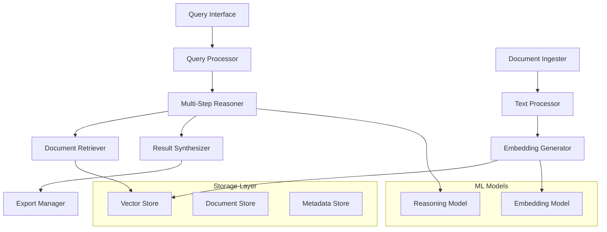

# Deep Researcher Agent Design Document

## Overview

The Deep Researcher Agent is a sophisticated Python-based system that provides comprehensive research capabilities through local embedding generation, multi-step reasoning, and efficient document retrieval. The system operates entirely offline, using local models and storage to ensure privacy and eliminate dependencies on external APIs.

The architecture follows a modular design with clear separation of concerns: document ingestion and preprocessing, local embedding generation, vector storage and retrieval, query processing with multi-step reasoning, and result synthesis and export.

## Architecture

The system follows a layered architecture with the following main components:



## Components and Interfaces

### 1. Document Ingestion Pipeline

**DocumentIngester**
- Handles multiple document formats (PDF, TXT, DOCX, MD, HTML)
- Extracts text content and metadata
- Chunks documents into manageable segments
- Interface: `ingest_document(file_path: str) -> DocumentChunks`

**TextProcessor**
- Cleans and normalizes text content
- Handles encoding issues and special characters
- Splits text into semantic chunks using sliding windows
- Interface: `process_text(raw_text: str) -> List[TextChunk]`

### 2. Embedding Generation

**EmbeddingGenerator**
- Uses sentence-transformers library for local embedding generation
- Supports multiple embedding models (all-MiniLM-L6-v2, all-mpnet-base-v2)
- Batch processing for efficiency
- Interface: `generate_embeddings(texts: List[str]) -> np.ndarray`

**ModelManager**
- Manages loading and caching of embedding models
- Handles model selection based on use case
- Interface: `get_model(model_name: str) -> SentenceTransformer`

### 3. Vector Storage and Retrieval

**VectorStore**
- Uses FAISS for efficient similarity search
- Supports both flat and hierarchical indexing
- Handles incremental updates to the index
- Interface: `add_vectors(vectors: np.ndarray, metadata: List[dict])`, `search(query_vector: np.ndarray, k: int) -> List[SearchResult]`

**DocumentStore**
- Stores original document content and metadata
- Uses SQLite for structured metadata queries
- Maintains document-chunk relationships
- Interface: `store_document(doc: Document)`, `get_document(doc_id: str) -> Document`

### 4. Query Processing and Reasoning

**QueryProcessor**
- Parses and analyzes incoming queries
- Determines query complexity and type
- Interface: `process_query(query: str) -> ProcessedQuery`

**MultiStepReasoner**
- Decomposes complex queries into sub-tasks
- Executes reasoning steps sequentially
- Maintains context across reasoning steps
- Uses local language models for reasoning
- Interface: `reason(query: ProcessedQuery) -> ReasoningPlan`, `execute_step(step: ReasoningStep) -> StepResult`

**DocumentRetriever**
- Performs semantic search using embeddings
- Combines multiple retrieval strategies (dense, sparse, hybrid)
- Ranks and filters results based on relevance
- Interface: `retrieve(query_embedding: np.ndarray, filters: dict) -> List[Document]`

### 5. Result Synthesis and Export

**ResultSynthesizer**
- Combines information from multiple sources
- Resolves conflicts and identifies consensus
- Generates coherent summaries and reports
- Maintains source attribution
- Interface: `synthesize(documents: List[Document], query: str) -> ResearchReport`

**ExportManager**
- Handles export to multiple formats (PDF, Markdown)
- Maintains formatting and structure
- Includes citations and references
- Interface: `export(report: ResearchReport, format: str) -> str`

## Data Models

### Core Data Structures

```python
@dataclass
class Document:
    id: str
    title: str
    content: str
    metadata: Dict[str, Any]
    chunks: List[TextChunk]
    created_at: datetime
    source_path: str

@dataclass
class TextChunk:
    id: str
    content: str
    embedding: Optional[np.ndarray]
    document_id: str
    chunk_index: int
    metadata: Dict[str, Any]

@dataclass
class ProcessedQuery:
    original_query: str
    query_type: QueryType
    complexity_score: float
    sub_queries: List[str]
    expected_sources: int

@dataclass
class ReasoningStep:
    step_id: str
    description: str
    query: str
    dependencies: List[str]
    confidence: float

@dataclass
class ResearchReport:
    query: str
    summary: str
    key_findings: List[str]
    sources: List[Document]
    reasoning_steps: List[ReasoningStep]
    confidence_score: float
    generated_at: datetime
```

### Database Schema

**Documents Table**
- id (PRIMARY KEY)
- title
- content_hash
- metadata (JSON)
- created_at
- source_path

**Chunks Table**
- id (PRIMARY KEY)
- document_id (FOREIGN KEY)
- content
- chunk_index
- embedding_id
- metadata (JSON)

**Embeddings Table**
- id (PRIMARY KEY)
- chunk_id (FOREIGN KEY)
- vector (BLOB)
- model_name
- created_at

## Error Handling

### Exception Hierarchy

```python
class DeepResearcherError(Exception):
    """Base exception for all system errors"""

class DocumentIngestionError(DeepResearcherError):
    """Errors during document processing"""

class EmbeddingGenerationError(DeepResearcherError):
    """Errors during embedding creation"""

class RetrievalError(DeepResearcherError):
    """Errors during document retrieval"""

class ReasoningError(DeepResearcherError):
    """Errors during multi-step reasoning"""

class ExportError(DeepResearcherError):
    """Errors during result export"""
```

### Error Recovery Strategies

1. **Document Ingestion Failures**: Skip problematic documents, log errors, continue processing
2. **Embedding Generation Failures**: Retry with different model, fallback to simpler embeddings
3. **Retrieval Failures**: Use cached results, reduce query complexity, provide partial results
4. **Reasoning Failures**: Simplify reasoning steps, use fallback reasoning strategies
5. **Export Failures**: Try alternative formats, provide raw data export

### Logging and Monitoring

- Structured logging using Python's logging module
- Performance metrics tracking (query time, retrieval accuracy)
- Error rate monitoring and alerting
- Resource usage monitoring (memory, CPU, disk)

## Testing Strategy

### Unit Testing

- **Component Testing**: Test each component in isolation
- **Mock Dependencies**: Use mocks for external dependencies (file system, models)
- **Edge Cases**: Test error conditions, empty inputs, malformed data
- **Performance Testing**: Verify response times and resource usage

### Integration Testing

- **End-to-End Workflows**: Test complete research workflows
- **Data Pipeline Testing**: Verify document ingestion to retrieval pipeline
- **Multi-Step Reasoning**: Test complex query decomposition and execution
- **Export Functionality**: Verify all export formats work correctly

### Test Data Management

- **Synthetic Documents**: Generate test documents with known content
- **Benchmark Queries**: Create standard queries for performance testing
- **Ground Truth Data**: Maintain expected results for accuracy testing
- **Performance Baselines**: Track system performance over time

### Testing Framework

```python
# Example test structure
class TestDocumentRetriever:
    def test_simple_query_retrieval(self):
        # Test basic document retrieval
        pass
    
    def test_complex_multi_step_reasoning(self):
        # Test complex query decomposition
        pass
    
    def test_embedding_similarity_accuracy(self):
        # Test embedding quality and similarity matching
        pass
    
    def test_export_format_integrity(self):
        # Test export functionality
        pass
```

### Performance Benchmarks

- **Query Response Time**: < 5 seconds for simple queries, < 30 seconds for complex queries
- **Document Ingestion Rate**: > 100 documents per minute
- **Embedding Generation**: > 1000 text chunks per minute
- **Memory Usage**: < 4GB for 100K documents
- **Storage Efficiency**: < 10MB per 1000 documents including embeddings